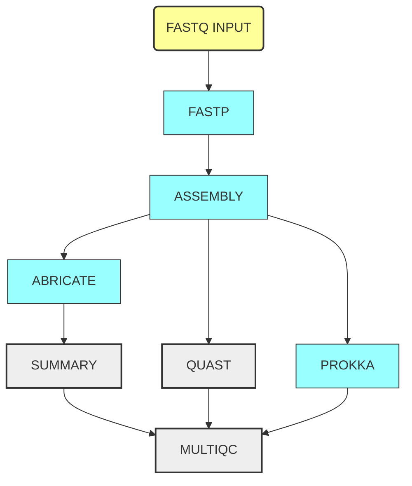

# A simple DSL2 pipeline

[Nextflow](https://www.nextflow.io/) is a workflow manager that allows the creation
of portable, scalable, reproducible pipelines.

Nextflow gives the possibility to separate the configuration and the logic of the
pipeline in different files.

Nextflow has a very strong support for different execution systems, so that you can
test your pipeline locally, but then deploy it in your cluster (using the installed
scheduler, such as Slurm or PBS), or to the cloud!

:arrow_right: [**Written tutorial**](https://telatin.github.io/microbiome-bioinformatics/Nextflow-start/)

## What are we doing

A simple workflow to assemble prokaryotic genomes, annotate them with Prokka, and
gathering statistics to prepare a MultiQC report.

This typical workflow processes a set of multiple samples (filtering, assemblying,
annotating), while for other steps will collect multiple outputs to produce
a summary (QUAST for assemblys statistics, MultiQC report).

## Resources

* [Learning Nextflow in 2022](https://www.nextflow.io/blog/2022/learn-nextflow-in-2022.html), blog post by Evan Floden & Alain Coletta
* [Nextflow tutorial (Carpentries)](https://carpentries-incubator.github.io/workflows-nextflow/index.html)
* [nf-core community](https://nf-co.re/), a set of high quality bioinformatics pipeline backed by a fantastic community: the pipelines, their YouTube channel and their Slack channels are all worth checking 
* [Video: introduction to MultiQC](https://www.youtube.com/watch?v=BbScv9TcaMg&ab_channel=PhilEwels), MultiQC is a great tool that makes any pipeline better, and Nextflow can make great use of it
